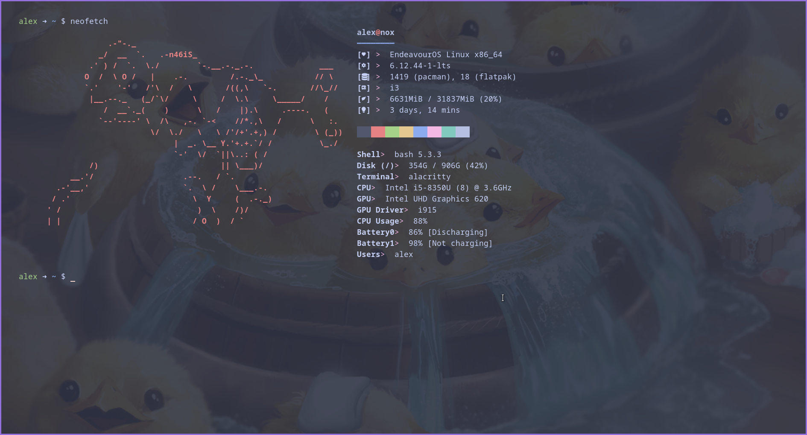
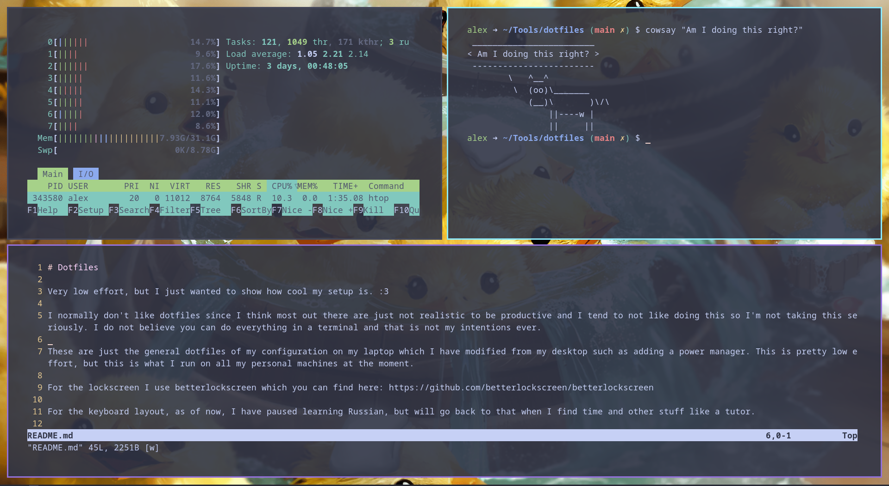
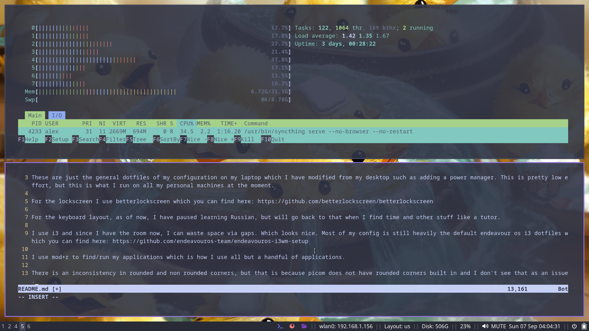
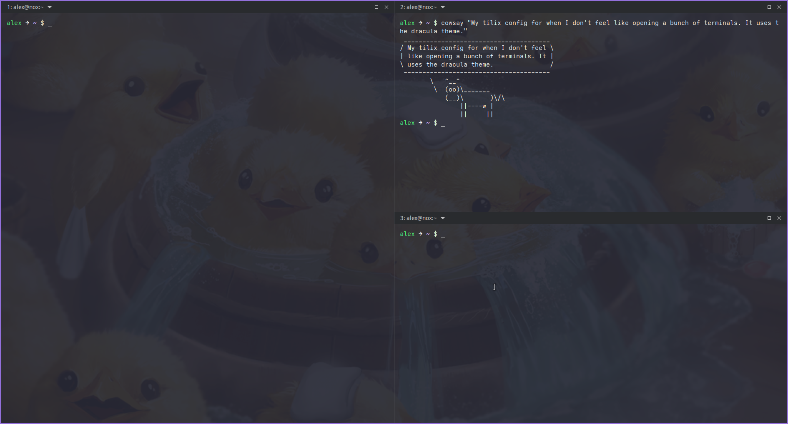
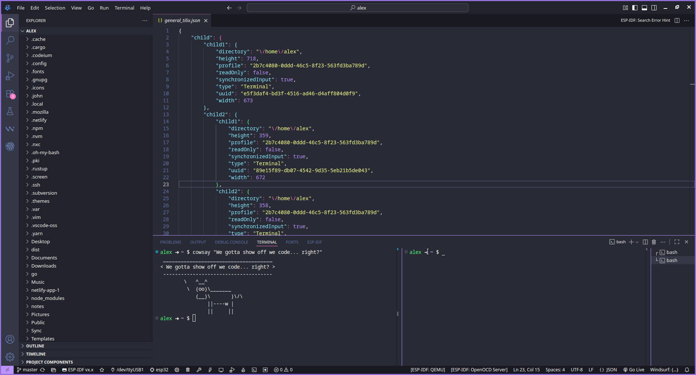

# Dotfiles

Very low effort, but I just wanted to show how cool my setup is. :3

I normally don't like dotfiles since I think most out there are just not realistic to be productive and I tend to not like doing this so I'm not taking this seriously. I do not believe you can do everything in a terminal and that is not my intentions ever.

These are just the general dotfiles of my configuration on my laptop which I have modified from my desktop such as adding a power manager. This is pretty low effort, but this is what I run on all my personal machines at the moment.

Mandatory screenshots:












For the lockscreen I use betterlockscreen which you can find here: https://github.com/betterlockscreen/betterlockscreen

For the keyboard layout, as of now, I have paused learning Russian, but will go back to that when I find time and other stuff like a tutor.

I use i3 and since I have the room now, I can waste space via gaps. Which looks nice. Most of my config is still heavily the default endeavour os i3 dotfiles which you can find here: https://github.com/endeavouros-team/endeavouros-i3wm-setup

I use mod+r to find/run my applications which is how I use all but a handful of applications.

For power (shutting down, restarting, log out, etc.), it is set to mod+esc. It is nothing special and just a simple menu on the right side.

To open terminal, it is mod+enter.

To open browser, it is mod+b.

There are other keybinds but this is what I use the most.

For wifi, I do use iwd, but for the menu, I installed iwmenu and have it set to mod+w and it gives a rofi menu. In my i3 config: `bindsym $mod+w exec --no-startup-id iwmenu -m rofi`

You can find iwmenu here: https://github.com/e-tho/iwmenu

No I am not going to take a screenshot of my wifi networks.

There is an inconsistency in rounded and non rounded corners, but that is because picom does not have rounded corners built in and I don't see that as an issue.

The icons used I believe is `eos-qogir-icons` and you can install that via:

```bash
sudo pacman -Sy eos-qogir-icons
```
I have it set to qogir-dark in lxappearance. The widget theme is vimix-dark-doder.

My wallpapers are in the wallpaper folder and you can change it on this line: exec --no-startup-id sleep 1 && feh --bg-fill /home/alex/Pictures/wallpaper/anime-duck-wallpaper.webp

(I usually either do something like this `cat .config/i3/config | grep "feh"` to find/check the command or I open it in vim and do `/feh` or whatever to search. To go to next found keyword, just press i to edit.)

---

General overview of my utils and such:

- WM: i3
- Terminal: alacritty
- Audio: Audacious
- Video: vlc
- Image viewer: Risterro or feh
- IDE: VS Codium (VS Code)
- Browser: Firefox
- File manager: Thunar
- Power manager: xfce4-power-manager
- Screenshot tool: xfce4-screenshooter
- Torrent clients: transmission or qbittorent
- Note client: Obsidian

I have a lot more application, but this would take too long.

In general, the themes I use are dracula or catpucchin. They give the dark themes I like while looking purdy. I favor dark flat themes. They just look nice especially on my eyes. I prefer urxvt over alacritty, but there is a bug in urxvt which caused the terminal to not spawn with the console line at the top depending on where/how the tiling wm is at or whatever and this is something that is just something urxvt was never made or able to properly fix.
